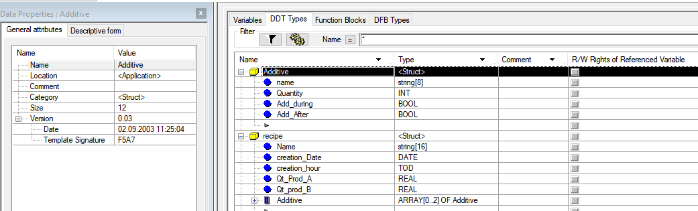
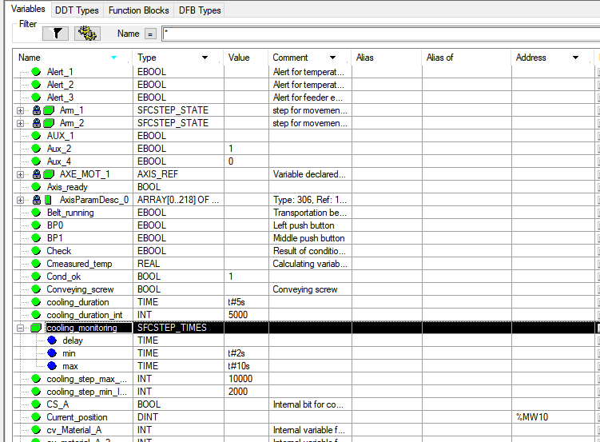

# Опис XEF файлу

 

```xml
<?xml version="1.0" encoding="UTF-8" standalone="yes"?>
<FEFExchangeFile>
    <fileHeader company="Schneider Automation" product="Unity Pro XL V13.1 - 180823C" dateTime="date_and_time#2024-7-6-12:49:1" content="Project source file" DTDVersion="41"></fileHeader>
    <contentHeader name="injection molding machine " version="0.0.000" dateTime="date_and_time#2018-7-17-18:11:22">
        <comment>Information This project is a OFFLINE project. That means the whole application is only for use in SIMULATION mode There is also a Microsoft Word file, that contains the differences between PL7/Concept to Unity and more information for this application.. Please read the "welcome file" at the process overview before starting this simulation Developed by Stefan Probst 07.05.2003</comment>
    </contentHeader>
</FEFExchangeFile>	
```

## commParameters

## IOConf

## DDTSource

Окремий розділ на кожнe DDT

```xml
<DDTSource DDTName="Additive" version="0.03" dateTime="dt#2003-09-02-11:25:04">
    <attribute name="TypeSignatureCheckSumString" value="F5A7"></attribute>
    <structure>
        <variables name="name" typeName="string[8]"></variables>
        <variables name="Quantity" typeName="INT"></variables>
        <variables name="Add_during" typeName="BOOL"></variables>
        <variables name="Add_After" typeName="BOOL"></variables>
    </structure>
</DDTSource>
```


```xml
<DDTSource DDTName="recipe" version="0.02" dateTime="dt#2003-09-02-11:39:43">
    <attribute name="TypeSignatureCheckSumString" value="F1B3"></attribute>
    <structure>
        <variables name="Name" typeName="string[16]"></variables>
        <variables name="creation_Date" typeName="DATE"></variables>
        <variables name="creation_hour" typeName="TOD"></variables>
        <variables name="Qt_Prod_A" typeName="REAL"></variables>
        <variables name="Qt_prod_B" typeName="REAL"></variables>
        <variables name="Additive" typeName="ARRAY[0..2] OF Additive"></variables>
    </structure>
</DDTSource>
```



```xml
<DDTSource DDTName="MODULE" version="0.02" dateTime="dt#2022-01-04-15:01:13">
    <attribute name="TypeSignatureCheckSumString" value="FEAB"></attribute>
    <structure>
        <variables name="STA" typeName="INT">
            <comment>стан/команда модуля для HMI</comment>
        </variables>
        <variables name="TYPE1" typeName="UINT">
            <comment>типи Submodule, комбінація в 16-комвому форматі BCD (0 - відсутній, 1- DICH, 2- DOCH, 3- AICH, 4 – AOCH, 5 - COM)</comment>
        </variables>
        <variables name="CHCNTS" typeName="UINT">
            <comment>кількість каналів на кожен Submodule, комбінація в 16-ковому форматі + 1 (16#XYZQ) X - для першого субмодуля</comment>
        </variables>
        <variables name="STA2" typeName="INT">
            <comment>додаткові стани модуля для HMI</comment>
        </variables>
        <variables name="STRTNMB" typeName="ARRAY[0..3] OF UINT">
            <comment>номер початкового каналу для відображення конкретного підмодуля</comment>
        </variables>
    </structure>
</DDTSource>
```


## EFBSource

## EFSource

## FBSource

## dataBlock

Для всіх екземплярів даних

```xml
<variables name="Arm_1_Timer" typeName="TON">
    <comment>Timer for movement arm 1</comment>
</variables>
<variables name="Temperature_monitoring_1" typeName="ALRM_DIA">
    <comment>Temp. low =&gt; Increase Temp. Setpoint</comment>
    <instanceElementDesc name="OP_CTRL">
        <value>True</value>
    </instanceElementDesc>
</variables>
<variables name="Table" typeName="ARRAY[0..10] OF INT">
    <instanceElementDesc name="[0]">
        <value>1</value>
    </instanceElementDesc>
    <instanceElementDesc name="[1]">
        <value>2</value>
    </instanceElementDesc>
</variables>
<variables name="cooling_monitoring" typeName="SFCSTEP_TIMES">
    <instanceElementDesc name="min">
        <value>t#2s</value>
    </instanceElementDesc>
    <instanceElementDesc name="max">
        <value>t#10s</value>
    </instanceElementDesc>
</variables
```




```xml
<variables name="VARS" typeName="VARS">
    <instanceElementDesc name="T1_LT1">
        <instanceElementDesc name="ID">
            <value>1</value>
        </instanceElementDesc>
    </instanceElementDesc>
    <instanceElementDesc name="T1_VRHEA_CPOS">
        <instanceElementDesc name="ID">
            <value>5001</value>
        </instanceElementDesc>
    </instanceElementDesc>
    <instanceElementDesc name="T1_VSLD_SOPN">
        <instanceElementDesc name="ID">
            <value>10001</value>
        </instanceElementDesc>
    </instanceElementDesc>
    <instanceElementDesc name="T1_VSLD_COPN">
        <instanceElementDesc name="ID">
            <value>20001</value>
        </instanceElementDesc>
    </instanceElementDesc>
</variables>
```


## Motion

## logicConf

## program

## SFCProgram

## animationTable

## IOScreen

## Documentation

## settings

